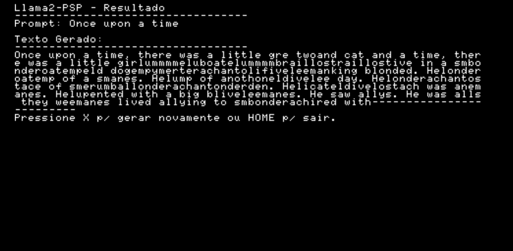

# Llama2 PSP
Inference Llama 2 in C on Playstation Portable (PSP) BY Caio Madeira.
Based on the inference work by ytmytm for [Llama 2 for c64](https://github.com/ytmytm/llama2.c64).

[Reposted by Yann LecCun](https://www.facebook.com/yann.lecun/posts/llama-2-has-been-ported-to-the-psp-in-addition-to-the-raspberry-pi-486-pc-commod/10161114909482143/)

## Running on Physical device

## Running on PPSSPP

## CHANGELOG  
03/08/25 - Now working only on PPSSPP. Using [Tiny Stories 260k model](https://huggingface.co/karpathy/tinyllamas/tree/main/stories260K).  

09/08/25 - Successfully executed on physical PSP hardware, but with some crash problems.   

---
## Porting Functions
The core of the adaptation is to map the REU hardware access to pointer access in the PSP's main RAM.

### Tokenizer.cpp vs tokenizer64.c
#### PSP's MIPS Architecture vs. x86 for PCs
The PSP's MIPS CPU is little-endian. The original C64 code that writes binary data (short and float) also writes in little-endian format (the least significant byte first).

### Transformer.cpp vs transformer64.c
The `TransformerWeights64` struct uses `typedef uint32_t REUPtr`.
An `REUPtr` is an absolute 32-bit address in the Commodore 64's REU memory.

In the PSP's context, I load the entire `weights.psp` file into a single memory block allocated with `malloc`. Therefore, all fields of the `REUPtr` type will not be absolute addresses in external memory, but rather `float` pointers that point to different locations within this large memory block.

I can either keep the `REUPtr` type but change its meaning to be an offset from the beginning of my weights memory block, or just change everything to `float*`.

### nnet.cpp vs nnet64.c
This file is the "brain" of the inference. It contains the implementations of the Transformer algorithms, such as matrix multiplication, normalization, and attention. Most of the heavy computational work occurs here.
In my case, I removed the `REU_getf` and `REU_putf` calls and replaced them with direct memory access on the PSP.

### math.c (from the c64 version)
We don't need it. We will use `<math.h>`.

### generate.cpp vs generatec64.c
`generate` is the main loop that produces the text, token by token.
It orchestrates the text generation process along with `sampler64.c` (or `sampler.cpp`).
